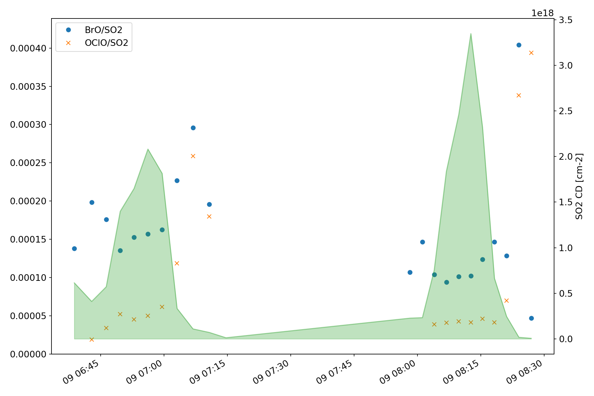
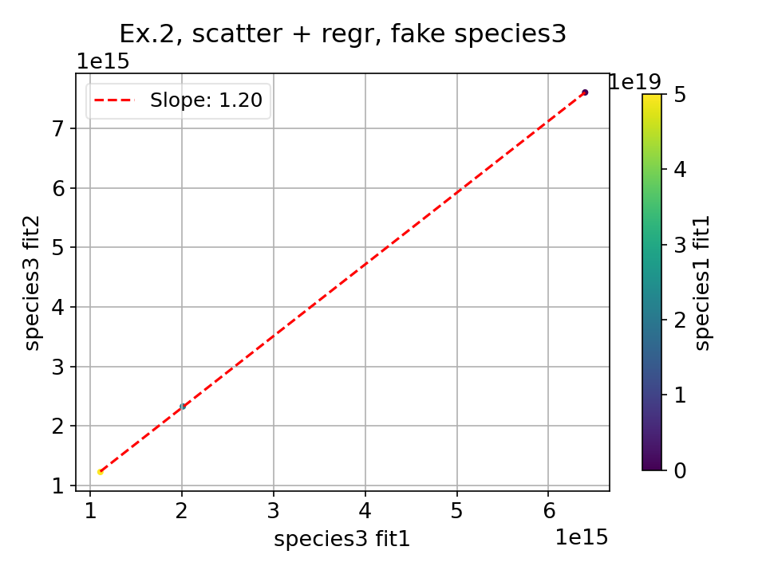

.. _examples:

***************
Example scripts
***************

On this page, some exemplary example scripts are presented, the scripts 
can be downloaded from the webpage.

Example 1 - Result import and plotting
======================================

**code**

.. literalinclude:: ../scripts/ex1_read_and_plot_example_data.py

**Code output**

  
  Ex1, Fig. 1: Time series of example results for 3 SO2 fits (top left), BrO (top right), O3 (bottom left) and OClO (bottom right)
   

  
  Ex2, Fig. 2: Time series of BrO/SO2 ratio (left y-axis) and corresponding SO2 CDs (green shaded, right y-axis) for same time series as shown in Fig. 1 
  
Example 2 - Define new import type and load fake data
=====================================================

**code**

.. literalinclude:: ../scripts/ex2_create_new_import_spec.py

**Code output**

  
  Ex2, Fig. 1: Scatter plot of fake species3 (fit1 vs. fit2) with species 1 (fit1) color coded
   